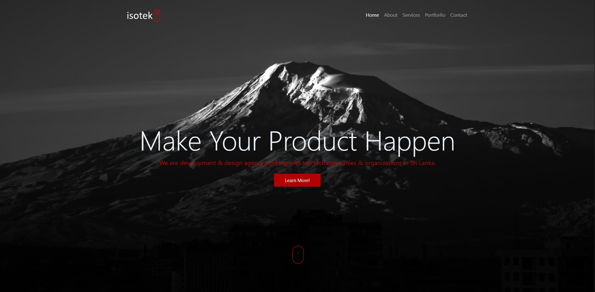
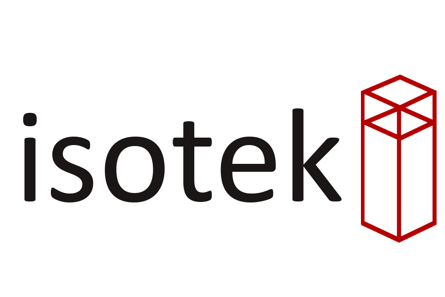

# iSoteklk.github.io


[![Contributors][contributors-shield]][contributors-url]
[![Stargazers][stars-shield]][stars-url]
[![Issues][issues-shield]][issues-url]
[![MIT License][license-shield]][license-url]
[![Fork][forks-shield]][forks-url]


[![alt text][1.1]][1]
[![alt text][2.1]][2]
[![alt text][3.1]][3]
[![alt text][6.1]][6]


<!-- TABLE OF CONTENTS -->
## Table of Contents

* [About the Project](#about-the-project)
  * [Built With](#built-with)
* [Getting Started](#getting-started)
* [Usage](#usage)
* [Roadmap](#roadmap)
* [Contributing](#contributing)
* [License](#license)
* [Contact](#contact)


<!-- ABOUT THE PROJECT -->
## About The Project



This is the official web page of iSotek Software Solutions


### Built With

* [Bootstrap](https://getbootstrap.com)
* [CSS](https://www.w3.org/Style/CSS/Overview.en.html)
* [JavaScript](https://www.javascript.com/)


<!-- GETTING STARTED -->

## Getting Started

1. Clone the repo
```sh
git clone https:://github.com/iSoteklk/iSoteklk.github.io.git
```
    

<!-- USAGE EXAMPLES -->
## Usage

You can use this templates in your own projects.


<!-- ROADMAP -->
## Roadmap

See the [open issues](https://github.com/iSoteklk/iSoteklk.github.io/issues) for a list of proposed features (and known issues).


<!-- CONTRIBUTING -->
## Contributing

Contributions are what make the open source community such an amazing place to be learn, inspire, and create. Any contributions you make are **greatly appreciated**.

1. Fork the Project
2. Create your Feature Branch (`git checkout -b feature/AmazingFeature`)
3. Commit your Changes (`git commit -m 'Add some AmazingFeature'`)
4. Push to the Branch (`git push origin feature/AmazingFeature`)
5. Open a Pull Request


<!-- LICENSE -->
## License

Distributed under the GNU GENERAL PUBLIC LICENSE. See `LICENSE` for more information.


<!-- CONTACT -->
## Contact

[](https://twitter.com/intent/follow?screen_name=isotek_lk) - contact.isotek@gmail.com </br>
[](https://twitter.com/intent/follow?screen_name=Dear__spider) - salithak1@gmail.com </br>
Project Link: [https://github.com/iSoteklk/iSoteklk.github.io](https://github.com/iSoteklk/iSoteklk.github.io)


<p align="center">
  
 </br>iSotek Software Solutions </br> 2019/20
</p>


<!-- MARKDOWN LINKS & IMAGES -->
<!-- https://www.markdownguide.org/basic-syntax/#reference-style-links -->
[contributors-shield]: https://img.shields.io/github/contributors/iSoteklk/iSoteklk.github.io.svg?style=flat-square
[contributors-url]: https://github.com/iSoteklk/iSoteklk.github.io/graphs/contributors
[forks-shield]: https://img.shields.io/github/forks/iSoteklk/iSoteklk.github.io
[forks-url]: https://github.com/iSoteklk/iSoteklk.github.io/network/members
[stars-shield]: https://img.shields.io/github/stars/iSoteklk/iSoteklk.github.io.svg?style=flat-square
[stars-url]: https://github.com/iSoteklk/iSoteklk.github.io/stargazers
[issues-shield]: https://img.shields.io/github/issues/iSoteklk/iSoteklk.github.io.svg?style=flat-square
[issues-url]: https://github.com/iSoteklk/iSoteklk.github.io/issues
[license-shield]: https://img.shields.io/github/license/iSoteklk/iSoteklk.github.io.svg?style=flat-square
[license-url]: https://github.com/kaweendras/iSoteklk.github.io/blob/master/LICENSE
[product-screenshot]: images/screenshot.png


[1.1]: http://i.imgur.com/tXSoThF.png (twitter)
[2.1]: http://i.imgur.com/P3YfQoD.png (facebook)
[3.1]: http://i.imgur.com/yCsTjba.png (google plus)
[6.1]: http://i.imgur.com/0o48UoR.png (github)


[1]: http://www.twitter.com/isotek_lk
[2]: #
[3]: #
[6]: http://www.github.com/iSoteklk
